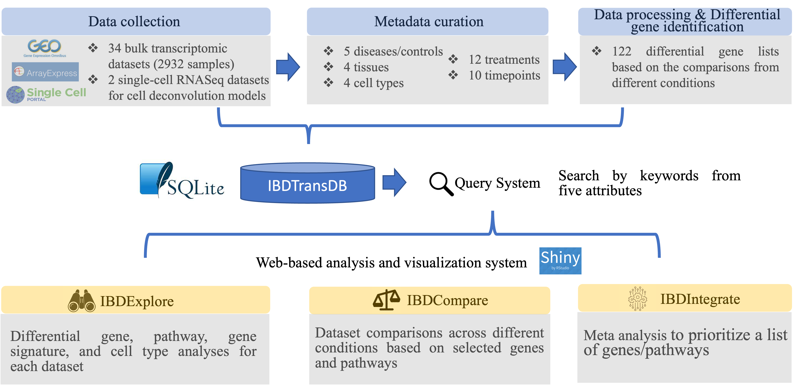

# IBDTransDB

<html>
<body>

<!-- ############ -->
<!-- IBDTransDB title and tool buttons -->
 
 

  

    

      <h1 class="text-center fit-h1" style="font-size: 24px; margin-bottom: 30px;">IBDTransDB: a manually curated transcriptomic database for inflammatory bowel disease</h1>
    

  

   
   

  

    

      <a class="btn btn-lg btn-tool" role="button" href="https://abbviegrc1.shinyapps.io/ibdexplore/" target="_blank" style="width: 250px;">IBDExplore</a>
    

    

      <a class="btn btn-lg btn-tool" role="button" href="https://abbviegrc2.shinyapps.io/ibdcompare/" target="_blank" style="width: 250px;">IBDCompare</a>
    

    

      <a class="btn btn-lg btn-tool" role="button" href="https://abbviegrc3.shinyapps.io/ibdintegrate/" target="_blank" style="width: 250px;">IBDIntegrate</a>
    

  

   

  

    

      <a class="btn btn-lg btn-tool" role="button" href="IBDExplore_tutorial.pdf" target="_blank" style="width: 200px;">Tutorial</a>
    

    

      <a class="btn btn-lg btn-tool" role="button" href="IBDCompare_tutorial.pdf" target="_blank" style="width: 200px;">Tutorial</a>
    

    

      <a class="btn btn-lg btn-tool" role="button" href="IBDIntegrate_tutorial.pdf" target="_blank" style="width: 200px;">Tutorial </a>
    

  

   
   
  

    NOTE: IBDTransDB runs in Shinyapps.io server that takes around 1 miniute to initialize the apps for the first time access. After initialization, the apps run fast. If taking over 1 miniute, please close the page and reopen again, which will reduce waiting time. 
  

  

    Please use Firefox or Safari to run IBDExplore due to potential javascript issue in Chrome.
  

   
   
  

    IBDTransDB is developed by Immunology Computational Biology, Genomics Research Center, AbbVie. 
  

  

 

<!-- 

  
A platform for target identification and validation

  <a class="btn btn-lg btn-primary" role="button" href="https://abbviesgrc1.shinyapps.io/ibdexplore/">IBDExplore</a>
  <a class="btn btn-lg btn-primary" role="button" href="https://abbviesgrc2.shinyapps.io/ibdcompare/">IBDCompare</a>
  <a class="btn btn-lg btn-primary" role="button" href="https://abbviegrc3.shinyapps.io/ibdintegrate/">IBDIntegrate</a>

   
  

-->
<!-- ############ -->

<!-- ############ -->
<!-- Description of ImmunoVerse  -->

   

  

    

      <h1 class="text-center fit-h1" style="font-size: 24px; margin-bottom: 30px;">OVERVIEW</h1>
    

  

  

    
Transcriptomic data have been widely used to understand the pathogenesis of inflammatory bowel disease (IBD) and identify the novel drug targets. To help biologists and clinicians with limited computational knowledge to access and analyze the public datasets from Gene Expression Omnibus (GEO) and ArrayExpress (AE), we propose IBDTransDB (<a href="go/ibdtransdb">go/ibdtransdb</a>), a manually curated transcriptomic database for IBD. IBDTransDB has five key features: (i) a manually curated database with 34 transcriptomic datasets (2932 samples) and 122 differential gene lists based on comparisons from different conditions; (ii) a query system supporting 35 keywords from five attributes (5 diseases/controls, 12 treatments, 10 timepoints, 4 tissues, and 4 cell types); (iii) IBDExplore:  interactive visualization of differential gene, pathway enrichment, gene signature, and  cell deconvolution analyses from individual dataset; (iv) IBDCompare: data set comparisons across different conditions based on selected genes or pathways; (v) IBDIntegrate: meta-analysis to prioritize a list of genes/pathways based on the selected data sets and comparisons. Based on these unique features, IBDTransDB will be a convenient and powerful tool for scientists to identify and validate IBD novel targets.
    

    
  

  
   
  

<!-- ############ -->

<!-- ############ -->
<!-- Graphics containing stats on IBDTransDB data  -->

  
  

    

      <h1 class="text-center fit-h1" style="font-size: 24px; margin-bottom: 30px;">IBDTransDB DATA SPANS</h1>
    

  

  <!-- 2 columns: row 1 - datasets, samples -->
  

    

      
34

      

        <h2>Datasets</h2>
      

    

    

      
2932

      

        <h2>Samples</h2>
      

    

  

  <!-- 3 columns: row 2 - treatments, tissues, cell types -->
  

    

      
12

      

        <h2>Treatments</h2>
      

    

    

      
4

      

        <h2>Tissues</h2>
      

    

    

      
4

      

        <h2>Cell Types</h2>
      

    

  

   
  

<!-- ############ -->

<!-- ############ -->
<!-- Footer  -->
<footer id="footer">
  Developed by Immunology Computational Biology, Genomics Research Center, AbbVie
</footer>
<!-- ############ -->

</body>
</html>

Transcriptomic data have been widely used to understand the pathogenesis of inflammatory bowel disease (IBD) and identify the novel drug targets. To help biologists and clinicians with limited computational knowledge to access and analyze the public datasets from Gene Expression Omnibus (GEO) and ArrayExpress (AE), we propose IBDTransDB (https://abbviegrc.shinyapps.io/ibdtransdb/), a manually curated transcriptomic database for IBD. IBDTransDB has five key features: (i) a manually curated database with 34 transcriptomic datasets (2932 samples) and 122 differential gene lists based on comparisons from different conditions; (ii) a query system supporting 35 keywords from five attributes (5 diseases/controls, 12 treatments, 10 timepoints, 4 tissues, and 4 cell types); (iii) IBDExplore: interactive visualization of differential gene, pathway enrichment, gene signature, and cell deconvolution analyses from individual dataset; (iv) IBDCompare: data set comparisons across different conditions based on selected genes or pathways; (v) IBDIntegrate: meta-analysis to prioritize a list of genes/pathways based on the selected data sets and comparisons. Based on these unique features, IBDTransDB will be a convenient and powerful tool for scientists to identify and validate IBD novel targets.

The tutorials of IBDExplore, IBDCompare and IBDIntegrate can be found below: 
 
 
 

